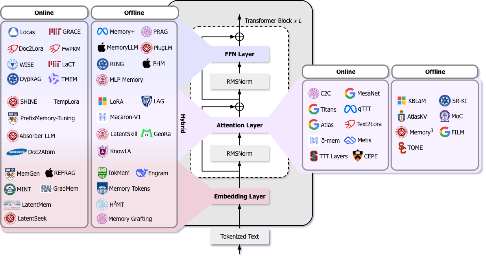

# Awesome In-Parameter Memory 

 <a href='[https://arxiv.org/abs/2609.36820]([https://www.researchgate.net/publication/415302231_Towards_In-Parameter_Memory_Augmentation_for_Large_Language_Models](https://www.researchgate.net/profile/Haoyu-Huang-8/publication/415302231_Towards_In-Parameter_Memory_Augmentation_for_Large_Language_Models/links/6ac5230d799bef11c4b09e37/Towards-In-Parameter-Memory-Augmentation-for-Large-Language-Models.pdf))'></a> 

This repository accompanies our survey paper:

> **Towards In-Parameter Memory Augmentation for Large Language Models**

---

This repository maintains a continuously updated collection of **in-parameter memory (IPM)** augmentation methods for large language models — methods that compose a memory-bearing parameter object $\phi$ (adapters, soft prompts, encoded KV banks, fast weights, online neural memory, memory tables) into the forward pass at inference time, whether it is acquired before or during deployment. We organize the literature using the **two-dimensional taxonomy** introduced in our survey:

🔷 **Parameter Placement** — *where* is the memory object composed into the transformer block? (**Embedding** / **Attention** / **FFN** / **Hybrid**)\
🔷 **Parameter Acquisition Time** — *when* is the deployed memory object formed? (**Online** during serving / **Offline** before serving)


<p align="center">
  
</p>

### News


### Contributing

🙋 If you would like to include your paper in this survey and repository, please feel free to submit a pull request, or open an issue with the paper's title and a brief summary highlighting its key techniques. You can also contact us via email.

🙋🏻‍♀️ Please let us know if you find any metadata, venue, classification, or link errors, or have suggestions for the repository. We greatly appreciate your feedback!

🌟 If you find this resource helpful for your work, please consider giving us a star and citing our research.

---

## Quick Index

- [Embedding Layer](#embedding-layer)
  - [Online Acquisition](#embedding--online-acquisition)
  - [Offline Acquisition](#embedding--offline-acquisition)
- [Attention Layer](#attention-layer)
  - [Online Acquisition](#attention--online-acquisition)
  - [Offline Acquisition](#attention--offline-acquisition)
- [FFN Layer](#ffn-layer)
  - [Online Acquisition](#ffn--online-acquisition)
  - [Offline Acquisition](#ffn--offline-acquisition)
- [Hybrid](#hybrid)
  - [Online Acquisition](#hybrid--online-acquisition)
  - [Offline Acquisition](#hybrid--offline-acquisition)
- [Insights from the Survey](#insights-from-the-survey)
  - [Trade-offs](#trade-offs)
  - [Open Directions](#open-directions)

---

## Embedding Layer

The memory object $\phi$ enters as continuous prompt tokens, prefixes, or latent input states appended before the first transformer block. Typical memory objects: **soft prompts, soft tokens, memory tables**. Embedding-side objects are the cheapest to compose (the backbone stays frozen), but their influence is indirect, mediated by every layer above.

### Embedding — Online Acquisition

The memory object is generated or updated while the model is serving, e.g., synthesized per request from the current hidden state or compressed from the context at test time.

|Paper|Memory Object|Acquisition Operator $\mathcal{A}$|Code|
| -- | -- | -- | -- |
| []() MemGen: Weaving Generative Latent Memory for Self-Evolving Agents [[Link](https://arxiv.org/abs/2509.24704)] | Soft Tokens | RL-trained trigger + LoRA weaver | [](https://github.com/KANABOON1/MemGen)  [MemGen](https://github.com/KANABOON1/MemGen) |
| MINT: Memory-Infused Prompt Tuning at Test-Time for CLIP [[Link](https://arxiv.org/abs/2506.03190)] | Soft Prompts | Test-time bank update | |
| []() GradMem: Learning to Write Context into Memory with Test-Time Gradient Descent [[Link](https://arxiv.org/abs/2603.13875)] | Soft Tokens | Test-time gradient descent | [](https://github.com/yurakuratov/gradmem)  [gradmem](https://github.com/yurakuratov/gradmem) |
| REFRAG: Rethinking RAG based Decoding [[Link](https://arxiv.org/abs/2509.01092)] | Soft Tokens | Selective expansion policy | |
| []() LatentMem: Customizing Latent Memory for Multi-Agent Systems [[Link](https://arxiv.org/abs/2602.03036)] | Soft Tokens | LMPO-trained composer | [](https://github.com/KANABOON1/LatentMem)  [LatentMem](https://github.com/KANABOON1/LatentMem) |
| LatentSeek: Seek in the Dark — Reasoning via Test-Time Instance-Level Policy Gradient in Latent Space [[Link](https://arxiv.org/abs/2505.13308)] | Soft Tokens | Test-time policy gradient | [](https://github.com/bigai-nlco/LatentSeek)  [LatentSeek](https://github.com/bigai-nlco/LatentSeek) |

<p align="right">↑ <a href="#quick-index">Back to Index</a> ↑</p>

### Embedding — Offline Acquisition

The memory object is formed before serving and held fixed, but still composed into the forward pass at deployment.

|Paper|Memory Object|Acquisition Operator $\mathcal{A}$|Code|
| -- | -- | -- | -- |
| []() TokMem: One-Token Procedural Memory for Large Language Models [[Link](https://arxiv.org/abs/2510.00444)] | Soft Tokens | Offline training | [](https://github.com/MANGA-UOFA/TokMem)  [TokMem](https://github.com/MANGA-UOFA/TokMem) |
| []() Engram: Conditional Memory via Scalable Lookup — A New Axis of Sparsity for Large Language Models [[Link](https://arxiv.org/abs/2601.07372)] | Memory Tables | Offline training | [](https://github.com/deepseek-ai/Engram)  [Engram](https://github.com/deepseek-ai/Engram) |
| []() The Power of Scale for Parameter-Efficient Prompt Tuning (Prompt-Tuning) [[Link](https://aclanthology.org/2021.emnlp-main.243/)] | Soft Prompts | Gradient optimization | [](https://github.com/google-research/prompt-tuning)  [prompt-tuning](https://github.com/google-research/prompt-tuning) |
| H²MT: Semantic Hierarchy-Aware Hierarchical Memory Transformer [[Link](https://arxiv.org/abs/2605.24930)] | Memory Tables | Bottom-up aggregation | |
| []() Memory Tokens: Large Language Models Can Generate Reversible Sentence Embeddings [[Link](https://aclanthology.org/2025.l2m2-1.14/)] | Soft Tokens | Gradient optimization | [](https://github.com/nsuruguay05/memory_token)  [memory_token](https://github.com/nsuruguay05/memory_token) |
| Memory Grafting: Scaling Language Model Pre-Training via Offline Conditional Memory [[Link](https://arxiv.org/abs/2605.20948)] | Memory Tables | Offline grafting | |

<p align="right">↑ <a href="#quick-index">Back to Index</a> ↑</p>

---

## Attention Layer

The memory object $\phi$ participates in attention as keys/values, attention-side adapters, or matrix-valued associative states. Typical memory objects: **encoded KV banks, adapters, fast weights, online neural memory, soft prompts**. Attention-side objects are content-addressable — query-key reads support associative lookup over large banks and recurrently updated states — at the cost of coupling to head structure and attention budget.

### Attention — Online Acquisition

A large family of test-time training (TTT) methods maintains online neural memory or fast weights at attention layers; KV-bank methods compose encoded representations per request.

|Paper|Memory Object|Acquisition Operator $\mathcal{A}$|Code|
| -- | -- | -- | -- |
| []() δ-mem: Efficient Online Memory for Large Language Models [[Link](https://arxiv.org/abs/2605.12357)] | Fast Weights | Gated delta rule | [](https://github.com/declare-lab/delta-Mem)  [delta-Mem](https://github.com/declare-lab/delta-Mem) |
| Metis: Memory Foundation Model [[Link](https://arxiv.org/abs/2607.26760)] | Online Neural Memory | Online write/read | [](https://github.com/MemTensor/Metis)  [Metis](https://github.com/MemTensor/Metis) |
| []() Cache-to-Cache (C2C): Direct Semantic Communication Between Large Language Models [[Link](https://arxiv.org/abs/2510.03215)] | Encoded KV Banks | Cache-to-cache transfer | [](https://github.com/thu-nics/C2C)  [C2C](https://github.com/thu-nics/C2C) |
| []() Titans: Learning to Memorize at Test Time [[Link](https://arxiv.org/abs/2501.00663)] | Online Neural Memory | Surprise-driven update | |
| ATLAS: Learning to Optimally Memorize the Context at Test Time [[Link](https://arxiv.org/abs/2505.23735)] | Online Neural Memory | Context-aware update | |
| []() Text-to-LoRA: Instant Transformer Adaption [[Link](https://arxiv.org/abs/2506.06105)] | Adapters | One-pass hypernetwork | [](https://github.com/SakanaAI/text-to-lora)  [text-to-lora](https://github.com/SakanaAI/text-to-lora) |
| []() PrefixMemory-Tuning: Modernizing Prefix-Tuning by Decoupling the Prefix from Attention [[Link](https://arxiv.org/abs/2506.13674)] | Soft Prompts | Test-time prefix generation | [](https://github.com/haonan3/PrefixMemory-Tuning)  [PrefixMemory-Tuning](https://github.com/haonan3/PrefixMemory-Tuning) |
| []() MesaNet: Sequence Modeling by Locally Optimal Test-Time Training [[Link](https://arxiv.org/abs/2506.05233)] | Online Neural Memory | Test-time training | [](https://github.com/fla-org/flash-linear-attention)  [flash-linear-attention](https://github.com/fla-org/flash-linear-attention) |
| []() qTTT: Let's (not) Just Put Things in Context — Test-Time Training for Long-Context LLMs [[Link](https://arxiv.org/abs/2512.13898)] | Online Neural Memory | Test-time training | |
| Infini-Transformer: Leave No Context Behind — Efficient Infinite Context Transformers with Infini-attention [[Link](https://arxiv.org/abs/2404.07143)] | Fast Weights | Compressive memory update | |
| []() M+: Extending MemoryLLM with Scalable Long-Term Memory [[Link](https://arxiv.org/abs/2502.00592)] | Encoded KV Banks | Test-time memory composition | [](https://github.com/wangyu-ustc/MemoryLLM)  [MemoryLLM](https://github.com/wangyu-ustc/MemoryLLM) |
| []() CEPE: Long-Context Language Modeling with Parallel Context Encoding [[Link](https://aclanthology.org/2024.acl-long.142/)] | Encoded KV Banks | Context encoder | [](https://github.com/princeton-nlp/CEPE)  [CEPE](https://github.com/princeton-nlp/CEPE) |
| []() TTT Layers: Learning to (Learn at Test Time) [[Link](https://arxiv.org/abs/2310.13807)] | Online Neural Memory | Test-time training | [](https://github.com/test-time-training/ttt-lm-pytorch)  [ttt-lm-pytorch](https://github.com/test-time-training/ttt-lm-pytorch) |
| Draft-KV: Learning Useful Latent Communication Between Language Models [[Link](https://arxiv.org/abs/2609.34754)] | Encoded KV Banks | Draft-then-verify | [](https://github.com/Svardfox/Draft-KV)  [Draft-KV](https://github.com/Svardfox/Draft-KV) |

<p align="right">↑ <a href="#quick-index">Back to Index</a> ↑</p>

### Attention — Offline Acquisition

The KV representations or attention-side parameters are organized before serving, e.g., learned prefixes or encoder-produced KV banks, and read at inference.

|Paper|Memory Object|Acquisition Operator $\mathcal{A}$|Code|
| -- | -- | -- | -- |
| []() Prefix-Tuning: Optimizing Continuous Prompts for Generation [[Link](https://aclanthology.org/2021.acl-long.353/)] | Soft Prompts | Gradient optimization | [](https://github.com/XiangLi1999/PrefixTuning)  [PrefixTuning](https://github.com/XiangLi1999/PrefixTuning) |
| []() KBLaM: Knowledge Base Augmented Language Model [[Link](https://arxiv.org/abs/2410.10450)] | Encoded KV Banks | Knowledge encoder | [](https://github.com/microsoft/KBLaM)  [KBLaM](https://github.com/microsoft/KBLaM) |
| []() AtlasKV: Augmenting LLMs with Billion-Scale Knowledge Graphs in 20GB VRAM [[Link](https://arxiv.org/abs/2510.17934)] | Encoded KV Banks | Knowledge encoder | [](https://github.com/HKUST-KnowComp/AtlasKV)  [AtlasKV](https://github.com/HKUST-KnowComp/AtlasKV) |
| []() MoC: Mixture of Chapters — Scaling Learnt Memory in Transformers [[Link](https://arxiv.org/abs/2603.21096)] | Memory Tables | Offline training | [](https://github.com/Tasmay-Tibrewal/Memory)  [MoC](https://github.com/Tasmay-Tibrewal/Memory) |
| []() SR-KI: Scalable and Real-Time Knowledge Integration into LLMs via Supervised Attention [[Link](https://arxiv.org/abs/2511.06446)] | Encoded KV Banks | Offline training | [](https://github.com/SharkSpicy-NLP/SR-KI)  [SR-KI](https://github.com/SharkSpicy-NLP/SR-KI) |
| Memory³: Language Modeling with Explicit Memory [[Link](https://arxiv.org/abs/2407.01178)] | Encoded KV Banks | Sparse KV selection | |
| []() FILM: Adaptable and Interpretable Neural Memory over Symbolic Knowledge [[Link](https://aclanthology.org/2021.naacl-main.288/)] | Encoded KV Banks | Offline training | |
| []() TOME: Mention Memory — Incorporating Textual Knowledge into Transformers through Entity Mention Attention [[Link](https://arxiv.org/abs/2110.06176)] | Encoded KV Banks | Offline training | [](https://github.com/google-research/language/tree/master/language/mentionmemory)  [mentionmemory](https://github.com/google-research/language/tree/master/language/mentionmemory) |
| Memory Attention [[Link](https://arxiv.org/abs/2609.28399)] | Memory Tables | Offline training | [](https://github.com/Joluck/memory-attention)  [memory-attention](https://github.com/Joluck/memory-attention) |

<p align="right">↑ <a href="#quick-index">Back to Index</a> ↑</p>

---

## FFN Layer

The memory object $\phi$ is stored in feed-forward parameters or FFN-substituting projections. Typical memory objects: **adapters, memory tables, fast weights, online neural memory**. FFN-side objects write into the layers where factual associations are stored, so edits can directly overwrite specific behaviors; however, the read is position-wise, with no content-based selection among entries.

### FFN — Online Acquisition

Adapters are generated on the fly by hypernetworks, or FFN-side states are updated continually during deployment.

|Paper|Memory Object|Acquisition Operator $\mathcal{A}$|Code|
| -- | -- | -- | -- |
| Locas: Your Models are Principled Initializers of Locally-Supported Parametric Memories [[Link](https://arxiv.org/abs/2602.05085)] | Adapters | Continual online edit | |
| Doc-to-LoRA: Learning to Instantly Internalize Contexts [[Link](https://arxiv.org/abs/2602.15902)] | Adapters | One-pass hypernetwork | [](https://github.com/SakanaAI/doc-to-lora)  [doc-to-lora](https://github.com/SakanaAI/doc-to-lora) |
| DyPRAG: Dynamic Parametric Retrieval Augmented Generation for Test-Time Knowledge Enhancement [[Link](https://arxiv.org/abs/2503.23895)] | Adapters | Test-time parametric generation | [](https://github.com/Trae1ounG/DyPRAG)  [DyPRAG](https://github.com/Trae1ounG/DyPRAG) |
| []() WISE: Rethinking the Knowledge Memory for Lifelong Model Editing of Large Language Models [[Link](https://arxiv.org/abs/2405.14768)] | Adapters | Side-memory edit | [](https://github.com/zjunlp/EasyEdit)  [EasyEdit](https://github.com/zjunlp/EasyEdit) |
| []() GRACE: Aging with GRACE — Lifelong Model Editing with Discrete Key-Value Adaptors [[Link](https://arxiv.org/abs/2211.11031)] | Adapters | Codebook update | [](https://github.com/Thartvigsen/GRACE)  [GRACE](https://github.com/Thartvigsen/GRACE) |
| FwPKM: Fast-Weight Product Key Memory [[Link](https://arxiv.org/abs/2601.00671)] | Fast Weights | Outer-product write | [](https://github.com/SakanaAI/fast-weight-product-key-memory)  [FwPKM](https://github.com/SakanaAI/fast-weight-product-key-memory) |
| []() LaCT: Test-Time Training Done Right [[Link](https://arxiv.org/abs/2505.23884)] | Online Neural Memory | Test-time training | [](https://github.com/a1600012888/LaCT)  [LaCT](https://github.com/a1600012888/LaCT) |
| Sparse Memory Finetuning: Continual Learning via Sparse Memory Finetuning [[Link](https://arxiv.org/abs/2510.15103)] | Memory Tables | Selective slot update | |
| TMEM: Scaling Self-Evolving Agents via Parametric Memory [[Link](https://arxiv.org/abs/2606.04536)] | Memory Tables | Test-time memory write | |

<p align="right">↑ <a href="#quick-index">Back to Index</a> ↑</p>

### FFN — Offline Acquisition

Knowledge is encoded into FFN-side parameters before serving, e.g., document-parameterized LoRA adapters or pretrained memory layers, and plugged in at inference.

|Paper|Memory Object|Acquisition Operator $\mathcal{A}$|Code|
| -- | -- | -- | -- |
| []() PRAG: Parametric Retrieval Augmented Generation [[Link](https://arxiv.org/abs/2501.15915)] | Adapters | Offline parametric RAG | [](https://github.com/oneal2000/PRAG)  [PRAG](https://github.com/oneal2000/PRAG) |
| PolyPRAG: Parametric Retrieval-Augmented Generation Using Latent Routing of LoRA Adapters [[Link](https://arxiv.org/abs/2511.17044)] | Adapters | Offline parametric RAG | |
| []() MLP Memory: A Retriever-Pretrained Memory for Large Language Models [[Link](https://arxiv.org/abs/2508.01832)] | Adapters | Offline training | [](https://github.com/Rubin-Wei/MLPMemory)  [MLPMemory](https://github.com/Rubin-Wei/MLPMemory) |
| MemoryLLM: Plug-n-Play Interpretable Feed-Forward Memory for Transformers [[Link](https://arxiv.org/abs/2602.00398)] | Memory Tables | Context-free FFN training | |
| []() Pretraining with Hierarchical Memories: Separating Long-Tail and Common Knowledge [[Link](https://arxiv.org/abs/2510.02375)] | Memory Tables | Offline pretraining | [](https://github.com/apple-aiml-research/ml-memory-pretraining)  [ml-memory-pretraining](https://github.com/apple-aiml-research/ml-memory-pretraining) |
| []() Memory Layers at Scale [[Link](https://arxiv.org/abs/2412.09764)] | Memory Tables | Offline training | [](https://github.com/facebookresearch/memory)  [memory](https://github.com/facebookresearch/memory) |
| []() PlugLM: Decouple Knowledge from Parameters for Plug-and-Play Language Modeling [[Link](https://aclanthology.org/2023.findings-acl.901/)] | Adapters | Offline training | [](https://github.com/Hannibal046/PlugLM)  [PlugLM](https://github.com/Hannibal046/PlugLM) |
| RING: Retrieval-Internalized Generation for Continual Large-Scale Knowledge Injection [[Link](https://arxiv.org/abs/2608.01630)] | Memory Tables | RL routing policy | |
| []() PKM: Large Memory Layers with Product Keys [[Link](https://arxiv.org/abs/1907.05242)] | Memory Tables | Offline training | [](https://github.com/facebookresearch/XLM)  [XLM](https://github.com/facebookresearch/XLM) |

<p align="right">↑ <a href="#quick-index">Back to Index</a> ↑</p>

---

## Hybrid

The memory object $\phi$ is composed at two or more sites (e.g., both attention and FFN). Typical memory objects: **adapters, online neural memory**. Hybrid stacks are the most expressive — shaping both what the model reads and how it computes — but updates must be coordinated across heterogeneous objects.

### Hybrid — Online Acquisition

|Paper|Memory Object|Acquisition Operator $\mathcal{A}$|Code|
| -- | -- | -- | -- |
| []() SHINE: A Scalable In-Context Hypernetwork for Mapping Context to LoRA in a Single Pass [[Link](https://arxiv.org/abs/2602.06358)] | Adapters | In-context hypernetwork | [](https://github.com/MuLabPKU/SHINE)  [SHINE](https://github.com/MuLabPKU/SHINE) |
| []() Temp-LoRA: With Greater Text Comes Greater Necessity — Inference-Time Training Helps Long Text Generation [[Link](https://arxiv.org/abs/2401.11504)] | Adapters | Inference-time training | [](https://github.com/TemporaryLoRA/Temp-LoRA)  [Temp-LoRA](https://github.com/TemporaryLoRA/Temp-LoRA) |
| Absorber LLM: Harnessing Causal Synchronization for Test-Time Training [[Link](https://arxiv.org/abs/2604.20915)] | Online Neural Memory | Test-time sync | |
| Doc-to-Atom: Learning to Compile and Compose Memory Atoms [[Link](https://arxiv.org/abs/2606.12400)] | Adapters | Document compiler | |
| Code2LoRA: Hypernetwork-Generated Adapters for Code Language Models under Software Evolution [[Link](https://arxiv.org/abs/2606.06492)] | Adapters | Hypernetwork | |

<p align="right">↑ <a href="#quick-index">Back to Index</a> ↑</p>

### Hybrid — Offline Acquisition

|Paper|Memory Object|Acquisition Operator $\mathcal{A}$|Code|
| -- | -- | -- | -- |
| []() LoRA: Low-Rank Adaptation of Large Language Models [[Link](https://arxiv.org/abs/2106.09685)] | Adapters | Gradient optimization | [](https://github.com/microsoft/LoRA)  [LoRA](https://github.com/microsoft/LoRA) 🌟 |
| Macaron-V1: Routing Each Turn to One Specialist LoRA on a Frozen Base [[Link](https://macaron.im/mindlab/research/introducing-macaron-v1)] | Adapters | Offline training | [](https://github.com/MindLab-Research/Macaron-V1)  [Macaron-V1](https://github.com/MindLab-Research/Macaron-V1) |
| LatentSkill: From In-Context Textual Skills to In-Weight Latent Skills for LLM Agents [[Link](https://arxiv.org/abs/2606.06087)] | Adapters | Offline compilation | [](https://github.com/yuaofan0-oss/LatentSkill)  [LatentSkill](https://github.com/yuaofan0-oss/LatentSkill) |
| []() KnowLA: Enhancing Parameter-Efficient Finetuning with Knowledgeable Adaptation [[Link](https://aclanthology.org/2024.naacl-long.396/)] | Adapters | Gradient optimization | [](https://github.com/nju-websoft/KnowLA)  [KnowLA](https://github.com/nju-websoft/KnowLA) |
| LAG: LoRA-Augmented Generation for Knowledge-Intensive Language Tasks [[Link](https://arxiv.org/abs/2507.05346)] | Adapters | Gradient optimization | |
| []()  GeoRA: Geometry-Aware Low-Rank Adaptation for RLVR [[Link](https://aclanthology.org/2026.acl-long.1110/)] | Adapters | Gradient optimization | |

<p align="right">↑ <a href="#quick-index">Back to Index</a> ↑</p>

---


## Citation

If you find this repository or our survey helpful, please consider citing:

```

```

## Acknowledgments

The organization and README style of this repository are inspired by [Awesome-KV-Cache-Optimization](https://github.com/jjiantong/Awesome-KV-Cache-Optimization) — a survey repository on system-aware KV cache optimization (ACL 2026 Findings). We thank its authors for setting an excellent example of how to maintain a survey-accompanying paper collection.
